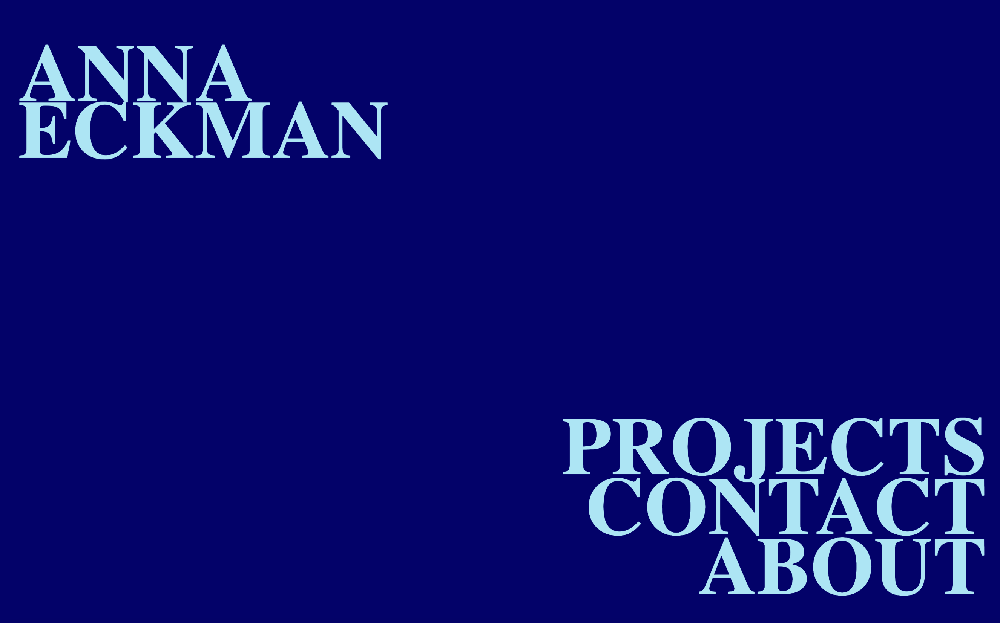
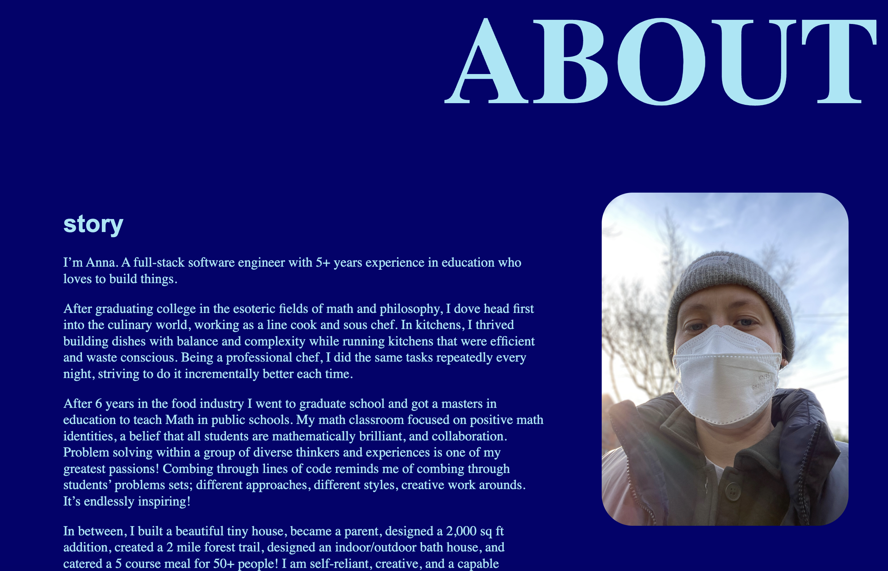
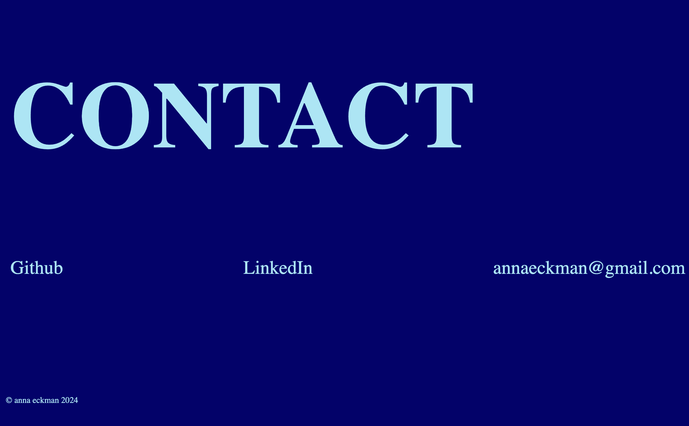

# Anna's Dev Portfolio

## Overview

- [Published Link](https://annaeckman.github.io/Portfolio/)

* Project Description and features
* Screenshots/Video
* Technology Used
* Features I would like to improve/add

### Published Link

### Project Description and features

- portfolio site featuring anna's about me page, projects, and contact info. The site is responsive, utilizes flexbox and flex grid, media queries, CSS animation and transform, and a flat BEM framework.

### Screenshots/Video Demo

[-Add Video Link here]()

### Technology Used

- HTML/CSS, JAVASCRIPT, BEM, FLEXBOX, FLEXGRID

### Features to add

-
